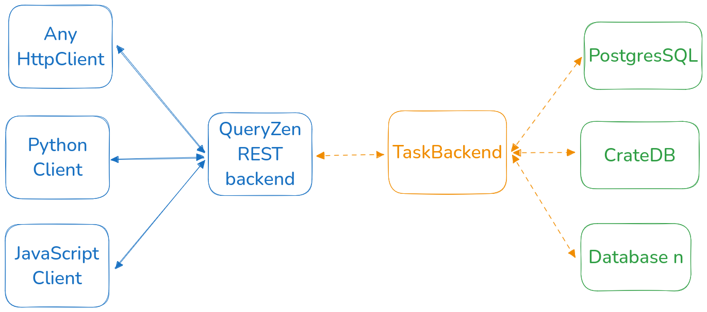

`QueryZen` is the set of subprojects that enable you to use supercharged SQL queries called `Zen`

The components are:

- A REST HTTP service in Django: It is the heart of the project. 
[link](https://github.com/surister/queryzen/tree/master/queryzen-api)
- A task execution backend in Celery: It runs the queries async/sync and is the core of the
  scheduling feature. [link](https://github.com/surister/queryzen/blob/master/queryzen-api/apps/core/tasks.py)
- Pythonic package to programmatically use the HTTP REST backed, it also has extra functionalities
to make your life easier. [link](https://github.com/surister/queryzen/tree/master/queryzen-client)
- A Database driver API, by extending this API you can make new databases compatible with QueryZen. [link](https://github.com/surister/queryzen/tree/master/queryzen-api/databases)

## Use cases for QueryZen:

* Quickly create HTTP Rest endpoints of your SQL data. 
* Integrate your SQL data in your data pipelines with minimal configuration.
* Monitor and analyze individual query executions over version and time.
* Version your SQL queries, build and test queries without affecting production.
* Create materialized views for SQL databases that do not support them.

## Architecture

The core pieces are the QueryZen backend and the task backend, any HTTP client can be used.

Supported databases are: SQLite, CrateDB and PostgresSQL, if you would like a new database, either develop it
yourself (link: how to develop a new database driver) or open a new issue in the (repository)[https://github.com/surister/queryzen/issues].